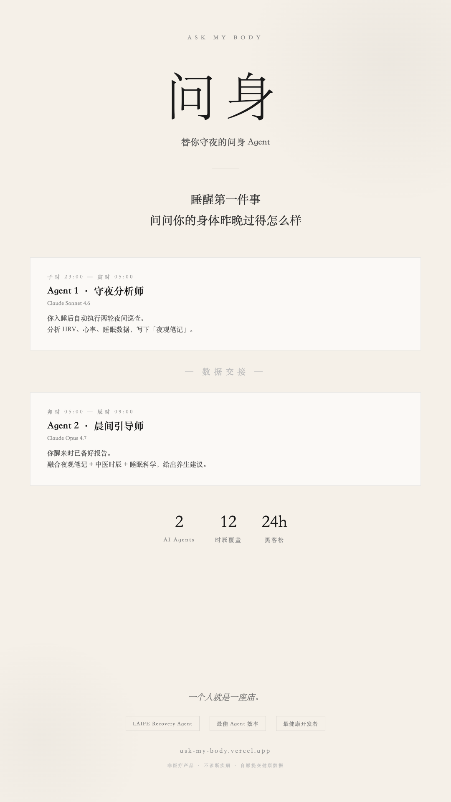

# Ask My Body｜求诸己

> 身体会知道答案。求诸己，就是向内求——让 AI 帮你读懂昨晚的身体。

**🌐 Live Demo → [ask-my-body.vercel.app](https://ask-my-body.vercel.app)**  
**📋 夜班证据 → [assets/night-shift-log.md](./assets/night-shift-log.md)**  
**🎤 Pitch 稿 → [assets/pitch-3min.md](./assets/pitch-3min.md)**

---



---

## 30 秒看懂

你睡觉的时候，两个 AI Agent 在夜里轮班工作。你醒来，拍一张 Apple Watch 截图上传，30 秒后拿到一份个人健康报告：昨晚身体经历了什么、今天该练哪个功法、脉象说明什么、今天吃什么。

**不是数字仪表盘。是你的身体在开口说话。**

---

## 核心场景

```
你入睡
  │
  ├─ 子时 23:00 ─▶ Agent 1「守夜分析师」自动唤醒
  │                Claude Sonnet 4.6 · Vercel Cron 触发
  │                分析睡前状态，写下第一轮夜观笔记
  │
  ├─ 寅时 03:00 ─▶ Agent 1 第二轮巡查
  │                深夜恢复窗口分析，更新夜观笔记
  │
你醒来，拍一张手表截图上传
  │
  ├─ Claude Vision 自动提取 ────────────────────────┐
  │    睡眠总时长 · 深度/核心/REM/清醒分期             │
  │    HRV 毫秒数 · 心率 BPM                         │
  │    中医脉象（沉脉/弦脉/滑脉…如有脉诊 App）          │
  │                                                  │
  └─▶ Agent 2「晨间引导师」综合所有数据 ◀─────────────┘
       Claude Opus 4.7
       ├─ 昨夜身体报告（睡眠分期 × 脉象 × 夜观笔记）
       ├─ 今日功法处方（站桩/八段锦/叩齿吞津…完整步骤）
       ├─ 梦境中医解读（如有记录）
       ├─ 今日饮食一句话
       └─ 当前时辰提醒（十二时辰驱动）
```

---

## 为什么与众不同

### 拍表即输入 — 用 Claude Vision 消灭数据门槛

所有健康 AI 都假设你配好了 OAuth、装好了 SDK。我们不假设。

用户只需**拍一张手表照片**上传，Claude 自动提取：

- 睡眠总时长 + 四阶段分期（深度 / 核心 / REM / 清醒）
- HRV 毫秒数、心率 BPM、入睡 / 起床时间
- **中医脉象**（如手表装了脉诊 App：沉脉、弦脉、浮脉……）

无注册 · 无 OAuth · 无手机手表连接 · 图片处理后即丢弃不存储

### Agent 在夜里工作，你只管睡觉

| | Agent 1 · 守夜分析师 | Agent 2 · 晨间引导师 |
|---|---|---|
| **模型** | Claude Sonnet 4.6 | Claude Opus 4.7 |
| **触发** | Vercel Cron 自动（子时 + 寅时）| 用户晨起上传截图 |
| **职责** | 夜间两轮巡查，写夜观笔记 | 综合所有数据，生成晨间报告 |
| **上下文传递** | → 写入 Vercel KV | ← 读取 Vercel KV |

两个 Agent 通过 KV 共享夜间分析结果，晨间引导师读到的不是冷启动，而是已经积累了一夜的观察。

### 功法处方 — 不是"多运动"，是今天具体做什么

基于你昨晚的实际数据，给出精确到动作的处方：

> **站桩**（推荐理由：HRV 44ms 偏低，静功养气优于有氧）
> - 做法：自然站立，双脚与肩同宽，膝微屈，双臂抱球于胸前…
> - 时长：15 分钟，分两组
> - 时机：今日辰时（07:00-09:00）空腹进行
> - 禁忌：膝盖不适者可靠墙减负

站桩 / 八段锦 / 五禽戏 / 静坐 / 叩齿吞津 / 鸣天鼓 / 搓涌泉 / 腹式呼吸…根据当天数据动态选择。

### 时辰即系统 — 中医十二时辰在代码层面驱动一切

时辰不是装饰词。`lib/shichen.ts` 里的十二时辰数据驱动三件事：

- Agent **语气基调**（子时深沉 · 卯时清醒 · 戌时舒缓）
- **推荐功法**（寅时肺经旺 → 腹式呼吸；午时心经旺 → 短暂静坐）
- **UI 氛围文案**（每个时辰独立的养生要义 + 晨起提醒）

### 脉象 × 睡眠数据 × 时辰 = 纯西医数据做不到的个性化

> *"沉脉主里证。结合昨夜凌晨 2:56 入睡、完全错过子时养胆的黄金窗口，气血内陷、阳气未能升发。长期晚睡耗伤肾气，肾水不足不能上济心火，故心率偏快、睡眠浮浅。今日宜温补，不宜耗散。"*

这段是真实生成的，数据来自开发者本人昨晚的手表截图。

---

## 技术架构

```
┌──────────────────────────────────────────────────────────────┐
│  用户侧                                                       │
│  Apple Watch 截图 ──→ 浏览器上传 ──→ /api/parse-watch        │
│                                   Claude Vision 提取健康数据  │
└─────────────────────────────┬────────────────────────────────┘
                              │
┌─────────────────────────────▼────────────────────────────────┐
│  Agent Pipeline                                               │
│                                                               │
│  子时 UTC 15:00 ──→ /api/cron-zishi ──→ Agent 1 Sonnet 4.6  │
│  寅时 UTC 19:00 ──→ /api/cron-yinshi ──→ Agent 1 Sonnet 4.6 │
│                             │                                 │
│                        Vercel KV（夜观笔记）                   │
│                             │                                 │
│  用户晨起 ──→ /api/generate-report ──→ Agent 2 Opus 4.7      │
│                             │                                 │
│                    今晨求诸己报告 → 浏览器渲染                  │
└─────────────────────────────┬────────────────────────────────┘
                              │
┌─────────────────────────────▼────────────────────────────────┐
│  持久层                                                       │
│  Vercel KV — 服务端，Agent 间上下文传递                        │
│  localStorage — 客户端，30 天报告历史 + HRV/心率/睡眠趋势图    │
└──────────────────────────────────────────────────────────────┘
```

---

## 功能清单

- [x] **Claude Vision 读表** — 上传手表截图，自动提取全部健康指标（含脉象）
- [x] **守夜分析师** — Vercel Cron 子时 + 寅时两轮自动触发，无需人工干预
- [x] **晨间引导师** — 综合夜观笔记 + Vision 数据，生成个性化晨间报告
- [x] **功法处方** — 按睡眠质量推荐具体传统功法，含完整操作步骤和禁忌
- [x] **梦境中医解读** — 结合睡眠分期 + 中医梦象理论，温和解读梦境信号
- [x] **脉象集成** — 支持脉诊 App 数据参与 AI 多维分析
- [x] **十二时辰系统** — 驱动 Agent 语气、推荐动作和 UI 氛围
- [x] **趋势追踪** — 本地存储 30 天，可视化 HRV / 心率 / 睡眠趋势对比
- [x] **睡前记录** — 可选的情绪 + 梦境预填写，为晨间报告提供素材
- [x] **零门槛设计** — 无账号、无 OAuth、无设备配对，打开即用

---

## 技术栈

| 层 | 技术 |
|---|---|
| 框架 | Next.js 14 App Router · TypeScript |
| 样式 | Tailwind CSS · Noto Serif SC · 水墨风设计系统 |
| LLM | Claude Opus 4.7（Agent 2 + Vision）· Claude Sonnet 4.6（Agent 1）|
| 代理 | 302.ai（Anthropic API 兼容中转）|
| 存储 | Vercel KV（服务端）· localStorage（客户端历史）|
| Cron | Vercel Cron Jobs（子时 UTC 15:00 · 寅时 UTC 19:00）|
| 部署 | Vercel |

---

## 快速开始

```bash
git clone https://github.com/mountionzeng/ask-my-body
cd ask-my-body
npm install
cp .env.example .env.local   # 填入 ANTHROPIC_API_KEY 等
npm run dev
# 访问 http://localhost:3000
```

所需环境变量见 [.env.example](./.env.example)。

---

## 项目结构

```
ask-my-body/
├── app/
│   ├── morning/           # 晨起求诸己（英雄页）
│   ├── sleep/             # 睡前记录
│   ├── journal/           # 身体日志 + 趋势图
│   ├── checkin/           # 快速签到
│   └── api/
│       ├── parse-watch/   # Claude Vision 读表接口
│       ├── generate-report/ # Agent 2 触发
│       ├── cron-zishi/    # 子时 Cron → Agent 1
│       └── cron-yinshi/   # 寅时 Cron → Agent 1
├── lib/
│   ├── agents/
│   │   ├── night-watcher.ts   # Agent 1 守夜分析师
│   │   └── morning-guide.ts  # Agent 2 晨间引导师
│   ├── shichen.ts         # 十二时辰系统
│   ├── claude.ts          # Anthropic SDK 封装
│   ├── kv.ts              # Vercel KV（含内存降级）
│   └── local-store.ts     # 客户端历史存储
├── prompts/
│   ├── night-watcher.md   # Agent 1 System Prompt
│   └── morning-guide.md   # Agent 2 System Prompt
├── components/
│   ├── ShichenBadge.tsx   # 当前时辰展示
│   └── decorations.tsx    # 水墨装饰组件
└── assets/
    ├── night-shift-log.md # 夜班执行证据
    └── pitch-3min.md      # Pitch 稿
```

---

## 这是一个开发者自己用过的产品

黑客松两天，开发者用自己的身体测试了两次。

**第一天（五月廿一 · 周四）** — 凌晨 2:56 才入睡，睡了 6.7 小时，HRV 44ms，心率 85bpm。  
Agent 2 生成的报告写道：

> *"你昨晚直到凌晨两点五十六分才入睡，整整错过了子时养胆、丑时养肝的黄金修复窗口。HRV 44ms 提示自主神经仍处于应激状态，心率偏快印证了气血尚未收敛入里……"*

**第二天（五月廿二 · 周五）** — 睡了 7.15 小时，心率降至 72bpm，睡眠时长回升。  
但 HRV 从 44ms 骤降至 12ms（↓32 · 注意）——身体日志里的趋势卡立刻标红：

> *"你昨晚睡了七个多小时，时长是够的，但身体的恢复质量在下滑……"*

两天的数据，两份不同的报告，一条真实的趋势线。这不是 mock 数据。

---

## 评审维度对齐

| 奖项 | 具体体现 |
|---|---|
| 🩺 **LAIFE Recovery Agent** | 核心即睡眠恢复追踪；Agent 在中医恢复窗口期（子时/寅时）自主运行；功法处方针对恢复不足定制 |
| ⚙️ **最佳 Agent 执行效率** | 双 Agent 分工（Sonnet 高频 cron + Opus 高质量合成）；Vision + 文本多模态一次 API 完成数据提取；KV 作为 Agent 间共享上下文 |
| 🛌 **最健康开发者** | 开发者用自己真实睡眠数据开发测试；产品本身即是健康开发节奏的工具；夜班 cron 替代了熬夜手动分析 |
| 🏆 **全场奖** | 技术深度（多模态 + 双 Agent + 自主 cron）× 文化独特性（中医时辰 + 脉象 + 功法）× 场景真实性（开发者即第一用户）|

---

## 产品边界

Ask My Body 不是医疗产品，不诊断疾病，不声称治疗失眠。

中医时辰养生作为文化灵感与自我观察框架；现代睡眠科学作为低风险参考来源。所有建议温和、可选、非医疗性质。

健康数据原则：**自愿提交 · 最小采集 · 不做医疗判断 · 图片不存储**（Vision 处理后即丢弃）。

---

## License

MIT
